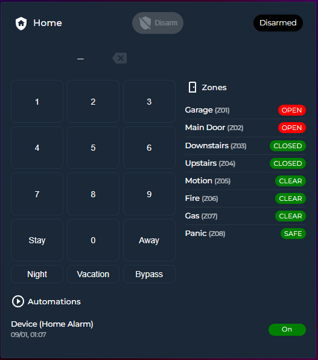

# Alarm and Security Card

[](https://hacs.xyz/)


> A customizable Lovelace security keypad + alarm panel for Home Assistant.

---

## Screenshots

* **Show All Zones View**


* **Open-Only Zones View**


* **On the Right Side**



* **Hide Keypad and Show as Icon**


---

## Features

* Alarm control (Disarm / Arm Home / Arm Away / etc.)
* Virtual numeric keypad
* Optional Alarmo integration (with countdown)
* Supports native `alarm_control_panel.*` alarms
* Zone visualization:

  * `open_only` mode
  * `all_zones` mode
  * Bottom or Right placement
* Automation toggles panel
* Customizable colors & labels
* Works standalone (no Alarmo required)

---

## Requirements

* Home Assistant
* Lovelace Dashboard
* An `alarm_control_panel.*` entity

Optional:

* Alarmo
* Binary sensors for zones
* Automation entities for automation panel

---

## Installation

### HACS (Recommended)

1. Go to **HACS**
3. Search and Install `Alarm and Security Card`
4. Ensure resource is loaded:

```yaml
lovelace:
  resources:
    - url: /hacsfiles/alarm-and-security-card/alarm-and-security-card.js
      type: module
```

### Manual Installation

1. Download `alarm-and-security-card.js`
2. Place into:

```
/config/www/
```

3. Add Lovelace resource:

```yaml
lovelace:
  resources:
    - url: /local/alarm-and-security-card.js
      type: module
```

---

## Minimal Example

```yaml
type: custom:alarm-and-security-card
entity: alarm_control_panel.home_alarm
title: Home
```

---

## Full Example

```yaml
type: custom:alarm-and-security-card
entity: alarm_control_panel.alarm_home_alarm
title: Home
colors:
  disarm_active: darkgreen
  disarm_inactive: grey
  disarming: orange
  armed_away: green
  armed_stay: blue
  armed_night: darkblue
  armed_vacation: darkblue
  armed_custom_bypass: yellow
  arming: orange
  pending: orange
  triggered: red
name_mapping:
  disarm_button: Disarm
  disarmed: Disarmed
  disarming: Disarming
  armed_away: Armed
  armed_stay: Armed (Home)
  armed_night: Armed (Night)
  armed_vacation: Armed (Vacation)
  armed_custom_bypass: Armed (Bypass)
  arming: Arming Soon
  pending: Enter Code and Disarm
  triggered: You fucking thief
zones:
  - entity: binary_sensor.alarm_zone_1
    name: Garage
    board_zone: 1
  - entity: binary_sensor.alarm_zone_2
    name: Main Door
    board_zone: 2
  - entity: binary_sensor.alarm_zone_3
    name: Downstairs
    board_zone: 3
  - entity: binary_sensor.alarm_zone_4
    name: Upstairs
    board_zone: 4
  - entity: binary_sensor.alarm_zone_5
    name: Motion
    board_zone: 5
  - entity: binary_sensor.alarm_zone_6
    name: Fire
    board_zone: 6
  - entity: binary_sensor.alarm_zone_7
    name: Gas
    board_zone: 7
  - entity: binary_sensor.alarm_zone_8
    name: Panic
    board_zone: 8
keypad:
  hide_keypad: false
  show_keypad_borders: true
  keypad_border_color: null
  keypad_width: 100
  keypad_height: 300
  action_button_1: arm_stay
  action_button_1_name: Stay
  action_button_2: arm_away
  action_button_2_name: Away
  action_button_3: arm_night
  action_button_3_name: Night
  action_button_4: arm_vacation
  action_button_4_name: Vacation
  action_button_5: arm_custom_bypass
  action_button_5_name: Bypass
zone_view: open_only # or all_zones
view_open_only:
  zone_section_title: Zones
  hide_zone_section_icon: true
  hide_zone_section_name: true
  show_zone_numbers: true
  show_zone_name: false
  color: red
  show_on: bottom # or right
view_all_zones:
  zone_section_title: Zones
  hide_zone_section_icon: false
  hide_zone_section_name: false
  show_zone_numbers: true
  show_zone_name: true
  color_on: red
  color_off: green
  show_on: bottom
automations:
  hide_automations: false
  automation_section_title: Automations
  hide_automation_section_icon: false
  hide_automation_section_name: false
  hide_last_triggered: false
  show_on: bottom
  automation_toggle_color: green
  automation_list:
    - automation.device_home_alarm
# FOR SECTION VIEW DASHBOARD
grid_options:
  columns: 18
  rows: auto
```

---

## Alarm Integration

### Alarmo Mode

If `alarmo` is detected in Home Assistant's services, the card switches to Alarmo control mode.

Mapping:

| Button Key        | Alarmo Mode   |
| ----------------- | ------------- |
| arm_home          | home          |
| arm_away          | away          |
| arm_night         | night         |
| arm_vacation      | vacation      |
| arm_custom_bypass | custom_bypass |

Additional Behavior:

* Uses `alarmo.arm` and `alarmo.disarm`
* Uses Alarmo's `delay` attribute for **live countdown** during `arming` and `pending`

### Native Mode

If Alarmo is not present, the card uses native `alarm_control_panel` services:

* `alarm_disarm`
* `alarm_arm_home`
* `alarm_arm_away`
* `alarm_arm_night`
* `alarm_arm_vacation`
* `alarm_arm_custom_bypass`

This makes Alarmo optional.

---


## License

MIT License
