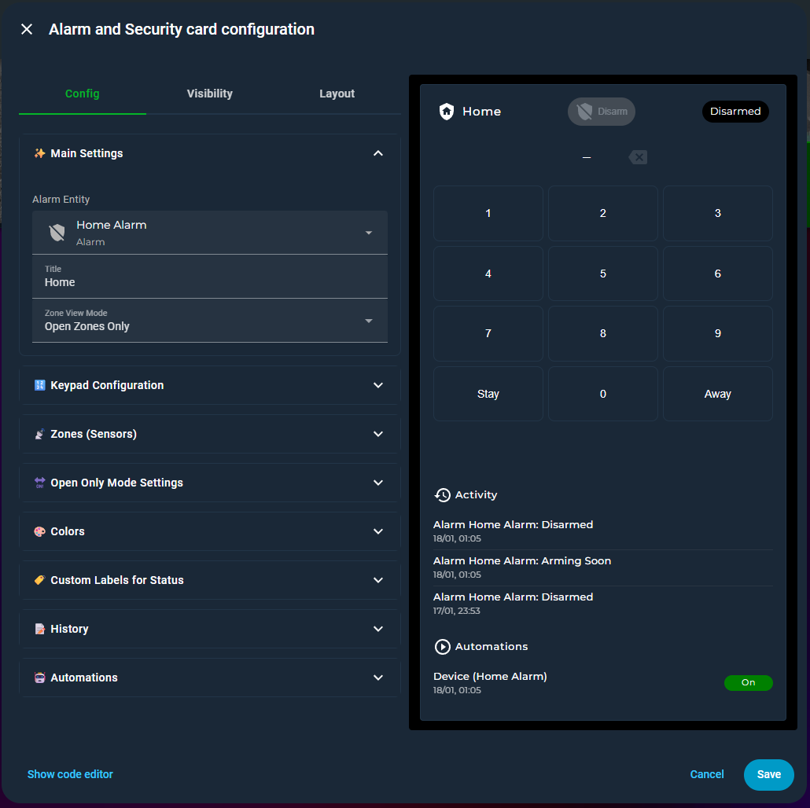
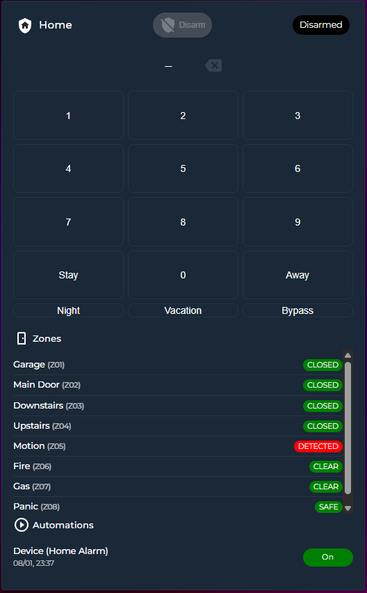
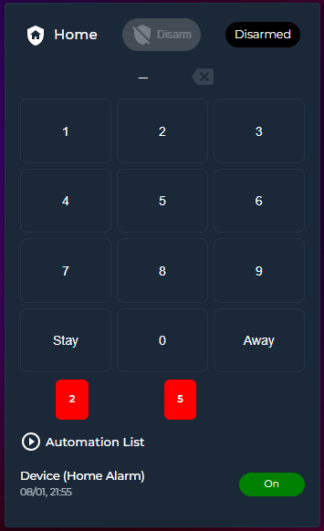
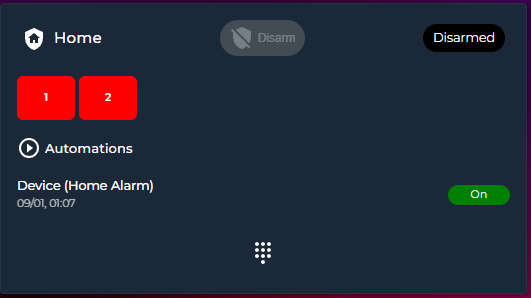
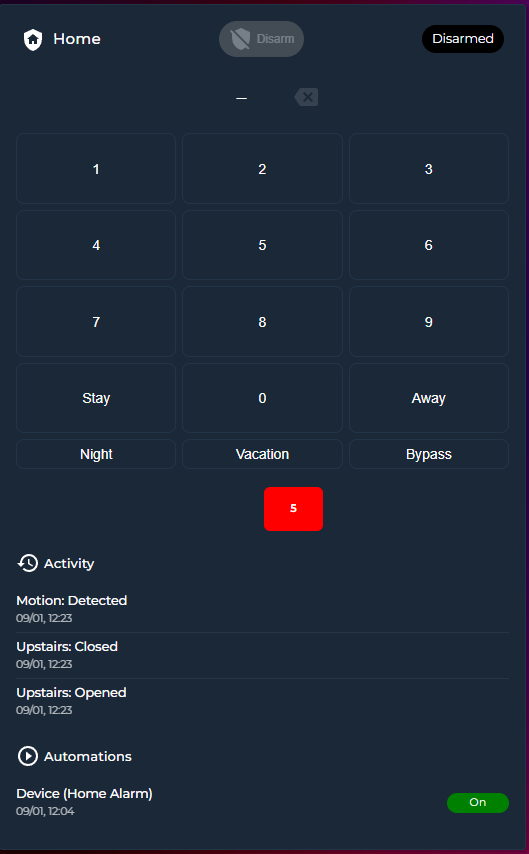

<a href="https://www.buymeacoffee.com/cataseven" target="_blank">
  
</a>     

# Alarm and Security Card

[](https://hacs.xyz/)


> A customizable Lovelace security keypad + alarm panel for Home Assistant.

---

## Screenshots

* **UI Editor**


* **Show All Zones View**



* **Open-Only Zones View**



* **On the Right Side**


* **Hide Keypad and Show as Icon**



* **History of activities**



* **3D Keypad Options (Soft, Strong and Inset**


---

## Features

* Alarm control (Disarm / Arm Home / Arm Away / Night / Vacation / Custom Bypass)
* Virtual numeric keypad
* Optional Alarmo integration (with countdown)
* Supports native `alarm_control_panel.*` alarms
* Zone visualization:

  * `open_only` mode
  * `all_zones` mode
  * Bottom or Right placement
* Automation toggles panel
* Customizable colors & labels
* Works standalone (no Alarmo required)

---

## Requirements

* Home Assistant
* Lovelace Dashboard
* An `alarm_control_panel.*` entity

Optional:

* Alarmo
* Binary sensors for zones
* Automation entities for automation panel

---

## Installation

### HACS (Recommended)

1. Go to **HACS**
2. Add this repository as a custom frontend (if needed)
3. Search and Install `Alarm and Security Card`
4. Ensure resource is loaded:

```yaml
lovelace:
  resources:
    - url: /hacsfiles/alarm-and-security-card/alarm-and-security-card.js
      type: module
```

### Manual Installation

1. Download `alarm-and-security-card.js`
2. Place into:

```
/config/www/
```

3. Add Lovelace resource:

```yaml
lovelace:
  resources:
    - url: /local/alarm-and-security-card.js
      type: module
```

---

## Minimal Example

```yaml
type: custom:alarm-and-security-card
entity: alarm_control_panel.home_alarm
title: Home
```

---

## Full Example

```yaml
type: custom:alarm-and-security-card
entity: alarm_control_panel.alarm_home_alarm
title: Home

colors:
  disarm_active: darkgreen
  disarm_inactive: grey
  disarming: orange
  armed_away: green
  armed_stay: blue
  armed_night: darkblue
  armed_vacation: darkblue
  armed_custom_bypass: yellow
  arming: orange
  pending: orange
  triggered: red

name_mapping:
  disarm_button: Disarm
  disarmed: Disarmed
  disarming: Disarming
  armed_away: Armed
  armed_stay: Armed (Home)
  armed_night: Armed (Night)
  armed_vacation: Armed (Vacation)
  armed_custom_bypass: Armed (Bypass)
  arming: Arming Soon
  pending: Enter Code and Disarm
  triggered: Alarm Triggered

zones:
  - entity: binary_sensor.alarm_zone_1
    name: Garage
    board_zone: 1
  - entity: binary_sensor.alarm_zone_2
    name: Main Door
    board_zone: 2
  - entity: binary_sensor.alarm_zone_3
    name: Downstairs
    board_zone: 3
  - entity: binary_sensor.alarm_zone_4
    name: Upstairs
    board_zone: 4
  - entity: binary_sensor.alarm_zone_5
    name: Motion
    board_zone: 5
  - entity: binary_sensor.alarm_zone_6
    name: Fire
    board_zone: 6
  - entity: binary_sensor.alarm_zone_7
    name: Gas
    board_zone: 7
  - entity: binary_sensor.alarm_zone_8
    name: Panic
    board_zone: 8

keypad:
  hide_keypad_and_show_as_icon: false
  show_keypad_borders: true
  keypad_border_color: null
  keypad_width: 100
  keypad_height: 300
  action_button_1: arm_stay
  action_button_1_name: Stay
  action_button_2: arm_away
  action_button_2_name: Away
  action_button_3: arm_night
  action_button_3_name: Night
  action_button_4: arm_vacation
  action_button_4_name: Vacation
  action_button_5: arm_custom_bypass
  action_button_5_name: Bypass

zone_view: open_only

view_open_only:
  zone_section_title: Zones
  hide_zone_section_icon: true
  hide_zone_section_name: true
  show_zone_numbers: true
  show_zone_name: false
  color: red

view_all_zones:
  zone_section_title: Zones
  hide_zone_section_icon: false
  hide_zone_section_name: false
  show_zone_numbers: true
  show_zone_name: true
  color_on: red
  color_off: green
  show_on: bottom

history:
  hide_history: false
  history_section_title: Activity
  hide_history_section_icon: false
  hide_history_section_name: false
  max_items: 5
  show_on: bottom

automations:
  hide_automations: false
  automation_section_title: Automations
  hide_automation_section_icon: false
  hide_automation_section_name: false
  hide_last_triggered: false
  automation_toggle_color: green
  automation_list:
    - automation.device_home_alarm

```

---

## Configuration Reference

### Top-level Options

| Parameter        | Type   | Default       | Allowed values           | Description                      |
| ---------------- | ------ | ------------- | ------------------------ | -------------------------------- |
| `entity`         | string | required      | `alarm_control_panel.*`  | Alarm panel entity               |
| `title`          | string | friendly name | any                      | Header title                     |
| `zone_view`      | string | `open_only`   | `open_only`, `all_zones` | Zone render mode                 |
| `colors`         | object | `{}`          | see below                | Custom state colors              |
| `name_mapping`   | object | `{}`          | see below                | Custom state labels              |
| `zones`          | list   | `[]`          | sensors                  | Zone definitions                 |
| `keypad`         | object | see below     | config                   | Keypad settings                  |
| `view_open_only` | object | see below     | config                   | Settings for open_only view      |
| `view_all_zones` | object | see below     | config                   | Settings for all_zones view      |
| `history` | object | see below     | config                   | Settings for activity history      |
| `automations`    | object | see below     | config                   | Automation panel                 |
| `grid_options`   | object | `{}`          | HA section               | Optional layout for Section view |

### Colors

| Key                   | Default | Description                     |
| --------------------- | ------- | ------------------------------- |
| `disarm_active`       | null    | Color when disarm button active |
| `disarm_inactive`     | null    | Color when inactive             |
| `arming`              | null    | Color of Arming state           |
| `pending`             | null    | Color of Pending entry delay    |
| `triggered`           | null    | Color of Triggered state        |
| `armed_away`          | null    | Color of Armed away             |
| `armed_stay`          | null    | Color of Armed stay/home        |
| `armed_night`         | null    | Color of Armed night            |
| `armed_vacation`      | null    | Color of Armed vacation         |
| `armed_custom_bypass` | null    | Color of Armed w/ bypass        |

### Name Mapping

Override HA localized names.

| Key                   | Description             |
| --------------------- | ----------------------- |
| `disarm_button`       | Label for Disarm button |
| `disarmed`            | Label for this state    |
| `arming`              | Label for this state    |
| `pending`             | Label for this state    |
| `triggered`           | Label for this state    |
| `armed_away`          | Label for this state    |
| `armed_stay`          | Label for this state    |
| `armed_night`         | Label for this state    |
| `armed_vacation`      | Label for this state    |
| `armed_custom_bypass` | Label for this state    |

### Zones

| Key          | Type   | Default       | Description          |
| ------------ | ------ | ------------- | -------------------- |
| `entity`     | string | required      | `binary_sensor.*`    |
| `name`       | string | friendly name | Display name         |
| `board_zone` | number | index         | Physical zone number |

### Keypad

| Key                            | Type          | Default | Description             |
| ------------------------------ | ------------- | ------- | ----------------------- |
| `hide_keypad_and_show_as_icon` | bool          | false   | Hides keypad, shows FAB |
| `show_keypad_borders`          | bool          | true    | Draw button borders     |
| `keypad_border_color`          | string        | null    | Border override         |
| `keypad_width`                 | number        | null    | Width %                 |
| `keypad_height`                | number/string | null    | Height px/vh/etc        |
| `enable_3d_effects`            | bool          | null    | 3D Keypad               |
| `effect_variant`               | object        | soft    | `soft`, `strong`, `inset` |
| `action_button_1`              | required      |   | Action button: `arm_vacation`, `arm_away`, `arm_stay`, `arm_night`,`disarm` etc.|
| `action_button_1_name`         | string        |   | Button labels           |
| `action_button_2`              | required      |   | Action button: `arm_vacation`, `arm_away`, `arm_stay`, `arm_night`,`disarm` etc.|
| `action_button_2_name`         | string        |   | Button labels           |
| `action_button_3`              | optional      | false   | Additional action button `arm_vacation`, `arm_away`, `arm_stay`, `arm_night`,`disarm` etc.|
| `action_button_3_name`         | string        |   | Button labels           |
| `action_button_4`              | optional      | false   | Additional action button `arm_vacation`, `arm_away`, `arm_stay`, `arm_night`,`disarm` etc.|
| `action_button_4_name`         | string        |   | Button labels           |
| `action_button_5`              | optional      | false   | Additional action button `arm_vacation`, `arm_away`, `arm_stay`, `arm_night`,`disarm` etc.|
| `action_button_5_name`         | string        |   | Button labels           |

### View: open_only

| Key                      | Default | Description          |
| ------------------------ | ------- | -------------------- |
| `zone_section_title`     | `Zones` | Header text          |
| `hide_zone_section_icon` | false   | Hide icon            |
| `hide_zone_section_name` | false   | Hide title           |
| `show_zone_numbers`      | true    | Show zone numbers    |
| `show_zone_name`         | true    | Show zone names      |
| `color`                  | null    | Color for open slots |

### View: all_zones

| Key                      | Default  | Description         |
| ------------------------ | -------- | ------------------- |
| `zone_section_title`     | `Zones`  | Header text         |
| `hide_zone_section_icon` | false    | Hide icon           |
| `hide_zone_section_name` | false    | Hide title          |
| `show_zone_numbers`      | true     | Show numbers        |
| `show_zone_name`         | true     | Show names          |
| `color_on`               | null     | Badge color open    |
| `color_off`              | null     | Badge color closed  |
| `show_on`                | `bottom` | `bottom` or `right` |

### History

| Key                            | Default       | Description                 |
| ------------------------------ | ------------- | --------------------------- |
| `hide_history`             | false         | Hide block                  |
| `history_section_title`     | `Activity` | Title                       |
| `hide_history_section_icon` | false         | Hide icon                   |
| `hide_history_section_name` | false         | Hide name                   |
| `max_items: 10,`          | 10         | Limit count             |
| `show_on`                | `bottom` | `bottom` or `right` |

### Automations

| Key                            | Default       | Description                 |
| ------------------------------ | ------------- | --------------------------- |
| `hide_automations`             | false         | Hide block                  |
| `automation_section_title`     | `Automations` | Title                       |
| `hide_automation_section_icon` | false         | Hide icon                   |
| `hide_automation_section_name` | false         | Hide name                   |
| `hide_last_triggered`          | false         | Hide timestamps             |
| `automation_toggle_color`      | null          | ON chip color               |
| `automation_list`              | []            | List of automation entities |

### Grid Options

Used for Section view dashboards.

| Key       | Type   | Description  |
| --------- | ------ | ------------ |
| `columns` | number | Column count |
| `rows`    | string | e.g. `auto`  |

---

## Alarm Integration

### Alarmo Mode

If `alarmo` is detected in Home Assistant services, the card switches to Alarmo control mode.

Mapping:

| Button Key          | Alarmo Mode     |
| ------------------- | --------------- |
| `arm_home`          | `home`          |
| `arm_away`          | `away`          |
| `arm_night`         | `night`         |
| `arm_vacation`      | `vacation`      |
| `arm_custom_bypass` | `custom_bypass` |

Additional Behavior:

* Uses `alarmo.arm` and `alarmo.disarm`
* Uses Alarmo's `delay` attribute for **live countdown** during `arming` and `pending`

### Native Mode

If Alarmo is not present, the card uses native `alarm_control_panel` services:

* `alarm_disarm`
* `alarm_arm_home`
* `alarm_arm_away`
* `alarm_arm_night`
* `alarm_arm_vacation`
* `alarm_arm_custom_bypass`

This makes Alarmo optional.

---

<a href="https://www.buymeacoffee.com/cataseven" target="_blank">
  
</a>     

## License

Apache-2.0 license
